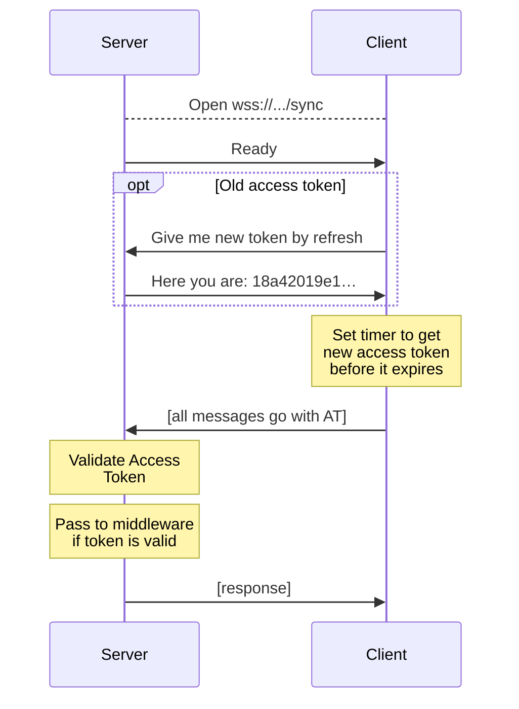
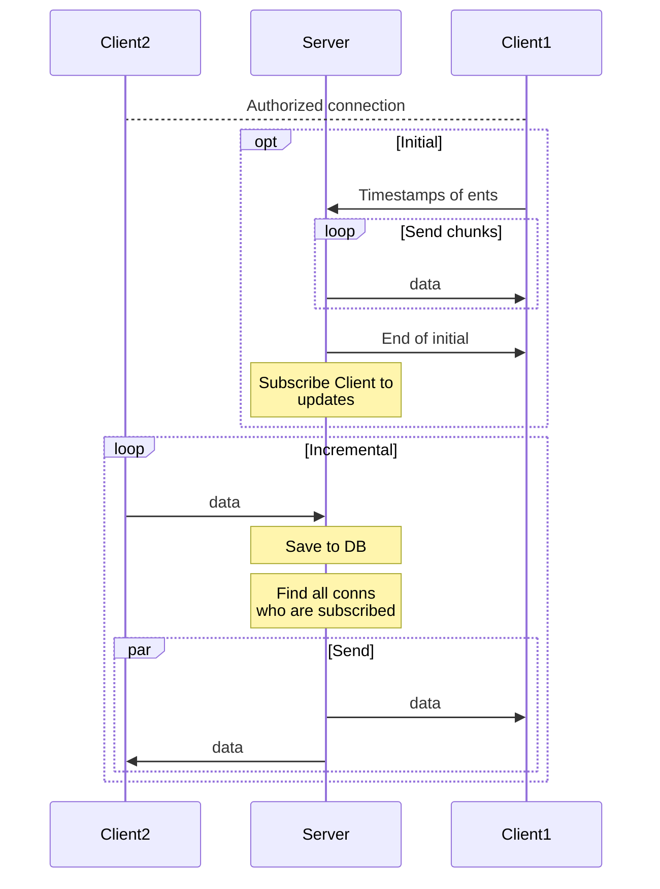
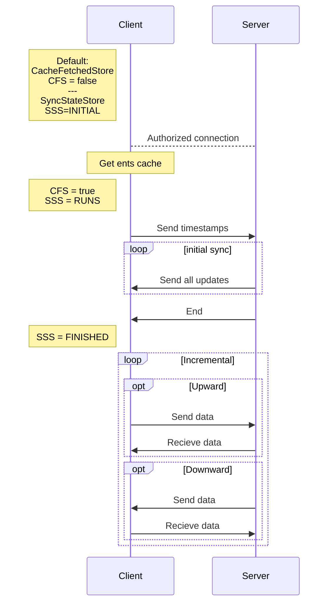

## WebSockets flow

Auth:



Sync:



Client states (I put it here to have it somehow in one place):



## How to debug sockets

1. `yarn testEnvMigrate` — running migrations and applying all the seeds
2. install [`websocat`](https://github.com/vi/websocat)
3. `websocat ws://0.0.0.0:8080/ws/9dJFMZADdoYhJ8E2SUxC0KLW2qYW3EaOyv6/sync`

### Example objects

Returns a category and a transaction: 

```json
{"type": "clientChanges", "data": {}}
```

Returns nothing:

```json
{"type": "clientChanges", "data": {"latestUpdated": "2020-01-01T14:20:52.147Z"}}
```

Updates a category name:

```json
{"type": "clientChanges", "data": { "latestUpdated": "2020-01-01T14:20:52.147Z", "entities": [ { "type": "category", "ent": { "id": "EaIYQnjW5o-twjHhriSsF","title": "!!!!!!!! Test rename category !!!!!!!!!","color": "#123456","isIncome": false,"clientUpdated": "2025-01-01T14:20:52.147Z", "updated": "2019-01-01T14:20:52.147Z"}}]}}
```

Update is ignored:

```json
{"type": "clientChanges", "data": { "latestUpdated": "2020-01-01T14:20:52.147Z", "entities": [ { "type": "category", "ent": { "id": "EaIYQnjW5o-twjHhriSsF","title": "@@@@@@@ Test rename category @@@@@@@@@","color": "#123456","isIncome": false,"clientUpdated": "2010-01-01T14:20:52.147Z", "updated": "2019-01-01T14:20:52.147Z"}}]}}
```
